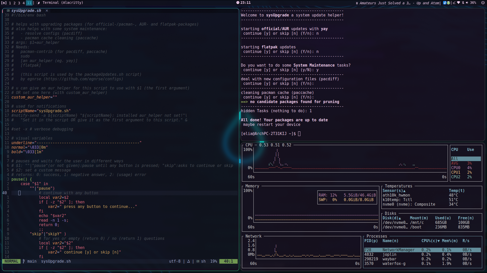

# some of my configs [WIP]
THIS IS STILL DEVELOPING and always will! PR/issues are very welcome.  

This config is for my arch/[hyprland](https://hyprland.org/) setup. It is made for a Laptop (with touch) and a PC (in a multimonitor setup, with (sadly) a nvidia graphicscard). Some of those configs I use on my (dualbooted-)windows pc too. (eg. nvim/alacritty)  

Make sure to install the packages needed for this config. (some dependencies are listed in each section, for a *fuller* list look into [#packages](#packages) in the [#Appendix](#appendix))  

This config uses the [Universal Wayland Session Manager (uwsm)](https://github.com/Vladimir-csp/uwsm) many (hyprland) parts will break without this dependency.  

I use an install script `./installV*.sh` to sym-link my local git with the config folders (mostly in `~/.config/`) and move some files around. [WIP]




## set up some config syncing
*(If u fork this first, u can sync and save your own configs)*  

### install script (sym linking) [WIP]
Clone the repo into a folder of your choosing and run the install script `./installV0.sh`.  
(!! the script is very fragile, change the variables in the script and look what it does !!)  
(most old files that the script will find it will move to ~/.config/.bak/)  
Currently some files still need to be moved manually. Most of them are files outside of `~/.config/`.  
TODO: make it more interactive (with an -a option?)  

[the old method can be found here](#old-setup-method-git-config)

## Synced configs:
<details>
  <summary>Overview</summary>

- [alacritty](#alacritty): (/alacritty/)
- [bash](#bash):      (/bash/)
- [dunst](#dunst):     (/dunst/)
- [git](#git):    (/other/.gitconfig)
- [hypridle](#hypridle):  (/hypr/)
- [hyprland](#hyprland):  (/hypr/)  
- [hyprlock](#hyprlock):  (/hypr/)
- [neovim](#nvim): (/nvim/)  
- [nwg-drawer](#nwg-drawer):    (/nwg-drawer/)
- [rofi](#rofi):    (/rofi/)
- [scripts](#scripts):  (/scripts/)  
- [sddm](#sddm): (/other/sddm.conf)
- [systemd](#systemd)    (/environment.d/))
- [tofi](#tofi):     (/tofi/)
- [v-editor](#v)       (/other/v-editor)  
- [vim](#vim):    (/other/.vimrc)  
- [waybar](#waybar):    (/waybar/)
- [wlogout](#wlogout):  (/wlogout/)  
- [general Theme](#general-theme): (egnrseTheme.\*)
- [misc](#misc):  (/other/\*)

{program name}: ({path in this git})

- [Appendix](#appendix)
	- [some Fixes](#some-fixes-for-common-issues)
	- [Packages](#packages)

</details>

wanting to add:
- nothing rn


### [alacritty](https://alacritty.org/config-alacritty.html)
*(/alacritty/)*  
This file has some visual changes to make alacritty more beautiful.  

<details><summary>Deprecated Win10 support</summary>

in win10 add: (does **NOT** work yet)  
```
[general]
import = ["../../Local/alacritty/alacritty.toml"]
```
to `%APPDATA%\alacritty\alacritty.toml`  
</details>


### bash
*(/bash/)*  
My config is split into two/three parts:  
- custom.bashrc (general settings)  
- aliases.bashrc (aliases for commands)  
- [~/.bashrc (for device specific settings, not fully in this git)]  

<details><summary>More Info</summary>

add this to your `~/.bashrc` (or similar) to source the files:
```
# fetches the config file for bash (if it exists)
# $customBashConfig_path is the path to the custom config file
customBashConfig_path="$HOME/.config/bash/custom.bashrc"
if [ -f "$customBashConfig_path" ]; then
	source $customBashConfig_path
else
	echo "path to config not found ($customBashConfig_path)"
fi
```
Some more infos are in the files.  
(be careful when setting environment variables)  

I use `trash-d`<sup>AUR</sup> as a drop in replacement for `rm` (TODO: look into autotrash<sup>AUR</sup>)
</details>

### [dunst](https://dunst-project.org/)
*(/dunst/)*  
A notification (service) daemon, after cloning and installing this git, all files should already be linked correctly (some explanations for the options are in the file)  
Some settings only work on X11! (those are be marked)  
There is a custom script `restartDunst.sh` that restarts dunst and sends some notifications, to easily test changes in dunstrc.  


### git
*(/other/.gitconfig)*  
Copy the parts that u like into `~/.gitconfig`. It has some useful aliases.  
Replace the placeholders if needed (eg {email}, {computerName}).  
(fully replacing your old config-file is **not** recommended)  


### hypridle
*(/hypr/)*  
An idle deamon. To start it automatically with systemd: `systemctl --user enable --now hypridle.service`  
Needs: [hyprland](#hyprland) [hyprlock](#hyprlock)  

### [hyprland](https://hyprland.org/)
*(/hypr/)*  
A wayland native (tiling/hybrid) window manager.  
This config is split into 4(+) parts:  
- hyperland.conf (the main config file)  
- look-feel.conf (animations, borders, gaps, ...)
- window-rules.conf (rules on how windows/layers/workspaces/apps behave)  
- maps.conf      (key mappings)
- plugins.conf	 (plugins, including plugin keymappings)
Many explanations are in the config files.  

This config uses the [Universal Wayland Session Manager (uwsm)](https://github.com/Vladimir-csp/uwsm)  and many parts will not work with out this dependency.  
See `https://wiki.hyprland.org/Useful-Utilities/Systemd-start/`  

<details> <summary>more (Keymappings/Plugings)</summary>

#### Keymappings
`SUPER+CTR+L`   : close/exit/logout-menu (wlogout)  
`SUPER+Q`       : opens $terminal (alacritty)  
`SUPER+E`       : opens File Browser (nemo)  
`SUPER+R`       : run a program (tofi)  
`SUPER+C`       : close active window  
  
`SUPER+[1-0]`   : go to workspace [1-10]  
`SUPER+S`       : go to special workspace  
`SUPER+SHIFT+[1-0]` : move current window to workspace [1-10]  
`SUPER+CTRL+[1-0]` : move current window to workspace (silently) [1-10]  
`SUPER+SIFT+S`  : move current window to special workspace  
  
`SUPER+V`       : toggle floating (for the active window)  
`SUPER+P`       : pin the active windows (to stay visible on all workspaces)  
`SUPER+O`       : toggle split Orientation (how the (old) window was split)    
`SUPER+I`       : switch split side  
`SUPER+M`       : maximize active window (keep borders/bars)  
`F11`           : make active window fullscreen  

`SUPER+D`       : program drawer (nwg-drawer)  
*(for more keymappings look into /hypr/maps.conf or /hypr/plugins.conf)*  

Move windows with `SUPER+LeftMouse`/`SUPER+Space`, resize them with`SUPER+RightMouse`/`SUPER+ALT+Space` (use `SHIFT` to keep the aspect ratio) or right-clicking on the edges and dragging.  

#### Plugins  
- [Hyprspace](https://github.com/KZDKM/Hyprspace): window overview (`SUPER+Tab`)(not used anymore)
- hypergrass: better touch-screen support (swipe from the bottom to left edge for the [wvkbd-latop](#onscreen-keyboard) keyboard)  

</details>

Needs: uwsm<sup>AUR</sup> alacritty tofi<sup>AUR</sup> waybar xdg-terminal-exec<sup>AUR</sup> wlogout<sup>AUR</sup> dunst nemo nwg-drawer [wvkbd-laptop](#onscreen-keyboard) bottom pa-notify<sup>AUR</sup>  
Works nicely with: hypridle hyprlock xdg-desktop-portal-hyprland  


### hyprlock
*(/hypr/hyprlock.conf/)*  
A screen lock config. It needs `egnrseTheme.conf` for the colors.

### [nvim](https://neovim.io/)
*(/nvim/)*  
Some explanations of the settings are in the files. The setup Leader-Key is Space. (meaning: some shortcuts start with the Space-Key)  
- Main setup in `init.lua`  
- Custom keymapings in `./lua/maps.lua`  
- Lazy Plugin Manager in `./lua/config/lazy.lua` (type `:Lazy` within nvim for the plugin menu)  
  Settings for the plugins are in their files (`./lua/plugins/*.lua`)  
  - bufferline (top bar with *file* tabs)
  - cmp (autocompletion)
  - colorscheme (tokyodark)
  - lualine (status line)
  - lush (color schemecreator, not used yet)
  - markdown (some inline rendering)
  - nvim-autopairs (autocomplete brackes and more)
  - nvim-lint (linting (eg. marking wrong code) WIP)
  - [nvim-tree](https://github.com/nvim-tree/nvim-tree.lua) (file explorer) {Leader+E}
  - misc (eg. nvim-colorizer)

Linting is still a WIP. You might need a bash-language-server.  

### [nwg-drawer](https://github.com/nwg-piotr/nwg-drawer)
*(/nwg-drawer/)*  
A program drawer with math / filesearch (currently disabled for performace reasons) support. Same usage as tofi, but slower and more graphical (eg. program icons/categories)  
Is silently started with some custom options when hyprland starts. You can also find those options in the `restart-nwg-drawer.sh` script.  
Use the math function by searching for eg. `8*4`. The answer will be shown in a popup when pressing `ENTER`.  
Needs: egnrseTheme.css  

### [rofi](https://github.com/lbonn/rofi)
*(/rofi/)*  
Similar to tofi, used for the custom wifimenu (of waybar). For wayland use the `rofi-wayland` package (and NOT `rofi`).  

### scripts
*(/scripts/)*  
Some of my custom scripts used by other configs (eg. waybar, hyprland).  
This config expects to find them in `$HOME/.local/share/bin/scripts`.  

Some scripts have settings/dependencies that are written in the top of the scripts. Some of the scripts will warn about and handle missing dependencies gracefully. (sadly not all of them yet)  

General Needs (for some of the scripts):
- wayland
- [hyprland](#hyprland)
- a notification daemon (eg. [dunst](#dunst))
- pacman-contrib

### [sddm](https://github.com/sddm/sddm)
*(/other/sddm.conf)*  
A display manager for X11 and Wayland sessions. I use it to login into accounts and select which compositer I want to use. It also allows me to select which compositor to login into, in the bottom left corner. (I also have KDE-Plasma installed (from the `plasma-meta` package))  
U can also select hyprland with and without uwsm, this config expects to be started *managed by uwsm*.  
Copy the config to `/etc/sddm.conf.d/sddm.conf`. If there are other config files already there, make sure sddm will read it last (see `man 5 sddm.conf`).  
A easy way to style sddm is with the KDE-System-Settings.  
(TODO: look into QtQuick for theme design, fix onscreen-keyboard env? kde_wayland?)  
Needs: breeze (the theme used)  

### systemd
*(/environment.d/)*  
Some environment variables for systemd. Prob. not well done currently. (!! is setting wayland variables !!)

### [tofi](https://github.com/philj56/tofi)
*(/tofi/)*  
A (very fast) wayland app launcher, with two themes. Select which one is active in `config`. `oldConf` has more explaining comments.  
Needs: `/usr/share/fonts/TTF/DejaVuSansMNerdFont-Regular.ttf` (look into [Nerd-Font](#nerd-font))


### v
*(/other/v-editor)*  
Use `v` in a console or script to launch the prefered editor (stored in *$EDITOR*).  
Copy the file to `/usr/bin/`, rename it to `v` and make it executable. More explanations are in the file.  
U can also use the alias in `bash/aliases.bashrc` for a simpler setup, with similar functionality.  
TODO: make this a proper package (in AUR?)  


### vim
*(/other/.vimrc)*  
This is a very simple setup that I use, when I can't use nvim.  
Copy the file to `~/`, some infos are in the file. I use Plug as a Plugin Manager, it should autoinstall itself. Should work on Win10 and Linux.  

### [waybar](https://github.com/Alexays/Waybar)
*(/waybar/)*  
A wayland statusbar, with some custom scripts for extra functionallity. U can right/left-click or scroll on many modules.  
There is a custom script `reloadConfig.sh` that reloads the configuration, to easily test changes for waybar.
There is also a custom wifimenu, a custom package update helper and many other features.  

The config is split into multiple parts:
- config.jsonc (main config)
- modules.jsonc (settings for most modules)
- modules/*  (settings for all other modules)
- style.css (styling)
- theme.css (colors used by style.css, imports `egnrseTheme.css`)
- scripts  (some scripts for extra functionality)

<details> <summary>Needs:</summary>
	
- uwsm<sup>AUR</sup> (for some app starts)
- `scripts/` (some scripts from this gits scripts folder)
- egnrseTheme.css (in this git)  
- [wlogout](#wlogout) (custom powermenu)
- wayland
- hyprctl (included in hyprland)
- a notification service (eg. [dunst](#dunst))
- rofi-wayland (for the custom wifi-menu, u can also mostly use rofi)
- networkmanager
- blueman-manager (bluetooth gui)
- wireplumber (audio-server, config has to be changed for it to work with ALSA only)
- pwvucontrol<sup>AUR</sup> helvum coppwr(flatpak) (audio-management gui)
Others: jq playerctl  

</details>

### wlogout
*(/wlogout/)*  
A wayland PowerMenu (to logout/shutdown/...). theme-1 is longer (6 items), theme-2 only 4 has options. Both themes have a layout-\* file and a styles-\*.css.  
U can use `/scripts/logoutlaunch.sh` (with args $1 being 1 or 2) to launch those themes. They (should) scale automatically with display size and scaling.  
Needs: egnrseTheme.css hyprland uwsm hyprlock  


### general Theme
*(egnrseTheme.\*)*  
still a work in progress  
The Idea is to have one file where I can change all colors for all apps/packages I use. Currently, I use 3: egnrseTheme.css/\*.conf/\*.sh . In many configs the colors are still hardcoded. (eg. dunst, tofi, rofi)  


### Misc
<details><summary>Other things that might be useful (mostly in the other folder).  </summary>

#### onScreen Keyboard
*(/other/wvkbd-laptop\*)*  
Put the binary `wvkbd-laptop` in a directory on the path (eg. `/usr/local/bin/`) to use it system-wide (hyprland/sddm/the desktop-entry expect that)  
Put the desktop-entry `wvkbd-laptop.desktop` in eg. `~/.local/share/applications/` (or follow the instructions in the file).  
Swipe with one finger from the bottom to the left edge (on a touch screen) to toggle the keyboards visibility. (within [hyprland](#hyprland) with the hyprgrass plugin)  

#### xdg-terminal-exec
*(/xdg-terminals.list)*  
Set your standart terminal for `xdg-terminal-exec`<sup>AUR</sup> in the file `xdg-terminals.list` (is not in the xdg standart yet). Also look into [#set Standart Terminal Emulator](set-standart-terminal-emulator).  
Needs: xdg-terminal-exec<sup>AUR</sup>

#### mimeapps.list
*(/mimeapps.list)*  
Set your default applications here (for different filetypes). You can also do this with the KDE-System-Settings or  
an easer way to do this is using the filemanager `Nemo`:  
`Right Click a file > select *Open With* > *Other Application...* > ` select the application u like and press *Set as default*  
This will also change the mimeapps.list file.  
u can find the mime-type of a file using `xdg-mime query filetype {FILE}`.
Also look into [#set Standart Terminal Emulator](set-standart-terminal-emulator).  

#### Dolphin
*(/other/servicemenus/\*)*  
Some files in the `other` folder are for Dolphin (KDE). To use them look into the files or look at [Dolphin](#dolphin-filemanager) under [Fixes](#some-fixes-for-common-issues)  

#### screenshot utility
*(/scripts/screenshot.sh, /other/screenshot.desktop)*  
Desktop entry (called `Snip Screen`) to trigger a screen shot with `grim` and `slurp`.  
TODO: more possible modes?

#### 'old' folder
*(/other/old/\*)*  
Everything in here is not in active use anymore with no idea if I will need it for sth. later on.  

#### [Nerd-Font](https://www.nerdfonts.com)
*(/other/DejaVuSansMono.zip)*  
The font used by some of the configs in this git.  
Download it or install it over pacman: `ttf-dejavu-nerd`  

</details>

# Appendix

### some fixes for common issues

<details> <summary>Expand?</summary>

#### Electron Apps
If apps are blurry (on wayland) it might be using Xwayland, you can fix this by adding the following to the launch-command of the app:  
(the launch command prob. is in `/usr/bin/{APP}`)  
`--enable-features=UseOzonePlatform --ozone-platform=wayland`  

#### set Standart Terminal Emulator
There sadly currently isn't a standardized way of doing that.  
Things that (kinda) work though:  
- Set the environment variable $TERMINAL (eg. in `~/.bashrc` with `TERMINAL=alacritty`)
- Use the mime-type for terminals (u can add them in `~/.config/mimeapps.list`). It is `x-scheme-handler/terminal=Alacritty.desktop`.  
- Use `xdg-terminal-exec`<sup>AUR</sup> to launch terminal applications ([Docs here](https://github.com/Vladimir-csp/xdg-terminal-exec)). Look into the file [xdg-terminals.list](./xdg-terminals.list) for how to configure and more information. ([rust implementation](https://codeberg.org/mkhl/xdg-terminal-exec))  
- For gnome (applications) use the xdg-terminal-exec method AND look at the [Nemo](#nemo-filemanager)  
- For KDE (applications) look at [Dolphin](#dolphin-filemanager).

#### Waterfox
When using the `waterfox-bin` package, I had some organization policies set. You can change them in `/opt/waterfox/distribution/policies.json`.  
To let the `KeepassXC-Browser` Plugin find KeepassXC u can copy the `native-messaging-hosts/` folder from `~/.mozilla` to `~/.waterfox` (given you have firefox installed, and the browser support (for firefox?) in KeepassXC enabled)

#### [Thorium](https://thorium.rocks/)
thorium-browser-bin<sup>AUR</sup>
To active native wayland use `--ozone-platform-hint=auto` as a startup flag or set `Preferred Ozone platform` to auto within the `chrome://flags/` menu (put the previous thing into the URL field of thorioum).  


#### Dolphin (filemanager)
Set the standart terminal for dolphin in `~/.config/kdeglobals` with:
```
[General]
TerminalApplication=alacritty
TerminalService=Alacritty.desktop
```
First row the command, second row the desktop-entry.  

To build/update the KDE **desktop-entry cache** (that Dolphin needs to find programs):
- have the `archlinux-xdg-menu` package installed
- run: `XDG_MENU_PREFIX=arch- kbuildsycoca6 --noincremental`
(kbuildsycoca6 is part of the kservice package, which is a dependency of dolphin)  
This fixes dolphin not finding programs.
**this function is in the rightclick menu of dolphin** (if u put the files from `/other/servicemenus` in the correct place)

To launch Dolphin (from the terminal) in the current directory use: `dolphin .`


#### Nemo (filemanager)
change the standart terminal to alacritty:  
`gsettings set org.cinnamon.desktop.default-applications.terminal exec alacritty`  
fix running shell-scripts with alacritty (needs the option -e):  
`gsettings set org.cinnamon.desktop.default-applications.terminal exec-arg e`  
more in the [ArchWiki-Nemo](https://wiki.archlinux.org/title/Nemo)  


#### Matlab
Look into the file [/other/matlabStart.sh](./other/matlabStart.sh) and look into [ArchWiki-Matlab](https://wiki.archlinux.org/title/MATLAB).  
I used the installer for linux from: [mathworks-download](https://de.mathworks.com/downloads/).


#### Pacman / Steam
In `/etc/pacman.conf` I enable `ParallelDownloads = 5` and the `multilib` library (multilib is required for the `steam` package).  
Other nice options: Color
(just remove the `#` before the lines)  
I used `rankmirrors` to rank the mirrors I chose in `/etc/pacman.d/mirrorlist`.

#### VLC Media Player
If the environment variable $DISPLAY is set, VLC will use X11 to display itself. (Because it is a bit buggy)  
To force VLC to use wayland, you can change the line with `Exec=` in `/usr/share/applications/vlc.desktop` to:  
`Exec=env -u DISPLAY /usr/bin/vlc --started-from-file %U`  
This will preserve the environment variable globally while unsetting it for VLC.  

#### Sunshine
The Flatpak doesn't have the right permission.  
Follow the Arch Linux install in: `https://docs.lizardbyte.dev/projects/sunshine/latest/about/setup.html`  
Then do: `sudo setcap -r $(readlink -f $(which sunshine))`  
Install all dependencies that sunshine needs. Symlink all libs that have the wrong version to the installed one. (in `/usr/lib`: sudo ln -s ./lib\*.so ./lib\*.so.1.83.0)

</details>

---

### cool/useful Packages
zerotier-one  
joplin-desktop<sup>AUR</sup>  
beeper-latest-bin<sup>AUR</sup>  
[coppwr](https://dimtpap.ovh/coppwr) (flathub)  
[sonusmix](https://codeberg.org/sonusmix/sonusmix)  
[xdg-terminal-exec-mkhl<sup>AUR</sup>](https://codeberg.org/mkhl/xdg-terminal-exec) (feels slower than xdg-terminal-exec though)

---
	
### Packages
<details> <summary>Some of the packages I use:</summary>

#### basics
base-devel neovim vim git sudo grub openssh efibootmgr  
man-db man-pages						(man pages)  
ntfs-3g exfat-utils 					(filesystem types)  
networkmanager blueman	    (internet/networking/bluetooth)  
flatpak wget pacman-contrib yay<sup>AUR</sup>		(package manager)  
pipewire pipewire-docs wireplumber wireplumber-docs helvum pwvucontrol<sup>AUR</sup> (audio)  
waybar dunst rofi-wayland nwg-drawer hypridle hyprlock wlogout<sup>AUR</sup> tofi<sup>AUR</sup> (statusbar, notifications, app-launcher, lock screen)  
polkit-kde-agent archlinux-xdg-menu wl-clipboard trash-d  (utilities)  
firefox alacritty konsole nemo dolphin  
ttf-dejavu-nerd fastfetch rclone zerotier-one  

#### window manager
plasma-meta hyprland sddm (kde, tiling WM, login)  
wayland-protocols uwsm<sup>AUR</sup> (managing wayland-WM)  
xdg-desktop-portal-hyprland xdg-desktop-portal-gtk (set them in /usr/share/xdg-desktop-portal/hyprland-portals.conf)  

#### misc
unzip zip  
libreoffice-fresh torbrowser-launcher prismlauncher appimagelauncher nheko 
strawberry vlc kalgebra

#### from AUR
spotify   
vesktop beeper-latest-bin (discord client, msg client)  
waterfox-bin thorium-browser-bin pa-notify (browser, notification on loudness change)  
xdg-terminal-exec ttf-ms-win10-auto (default terminal, win fonts)  
#### from Flatpak
(replace '\_' with spaces)  
keepassXC joplin bottles OBS_Studio moonlight coppwr
#### from somewhere else
sunshine matlab

</details>

---

### other useful (git) commands:
`git config core.sparseCheckout true` : can also add single files to the sparsity list (not only directories)  
`git config --global core.editor "nvim"`  
`git config status.showUntrackedFiles no`  
`git sparse-checkout list`  
`git read-tree -mu HEAD` : reload current files from tree
`git remote set-url origin github.com:egnrse/configs.git` : setup your `~/.ssh/config` for github first  
`git reset --hard origin/main` : reset current branch to origin/main (will discard all local changes)

use `~/.ssh/config`  
`ssh -T github` : test github connection  

<details> <summary>
	
### old setup method (git ~/.config)
</summary>
I used to use sparse-checkout and exlude to only get specific files with git. Except for files in the `other` folder all files should be at the right place after cloning this repo. 

Go into one of the following paths:  
unix: `~/.config/`  
win:  `C:\Users\<USERNAME>\AppData\Local\`
```
git init
git remote add origin https://github.com/egnrse/configs
git config core.sparseCheckoutCone true
```
Choose the folders that u want:
```
git sparse-checkout set alacritty bash dunst environment.d hypr nvim nwg-drawer scripts tofi waybar wlogout
```
(many of the configs rely on scripts and environment.d (or on each other) taking only a few might break things)  

Finish the setup:
```
git pull origin main
git branch --set-upstream-to=origin/main main
```

#### setup git exlude
`./.git/info/exlude`  
Is a file to exclude local files/folders from git.
Copy the content (that u need) of the file `/other/exclude` to `./.git/info/exclude`   

</details>
